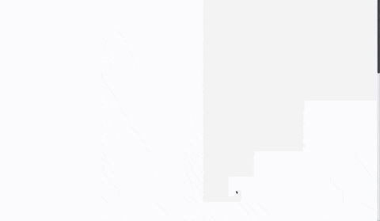
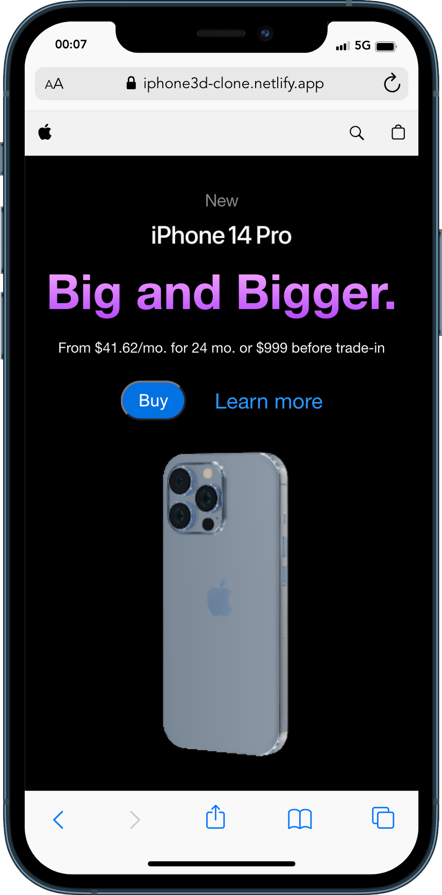
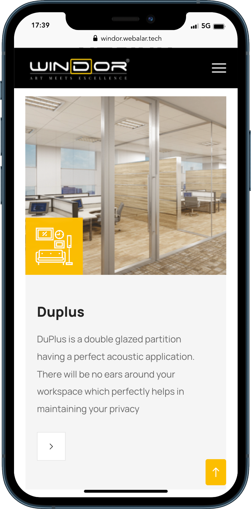
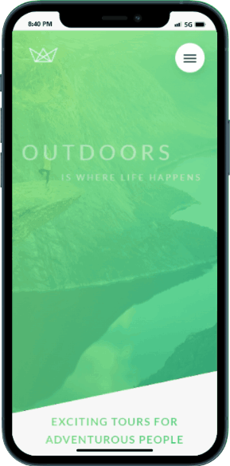
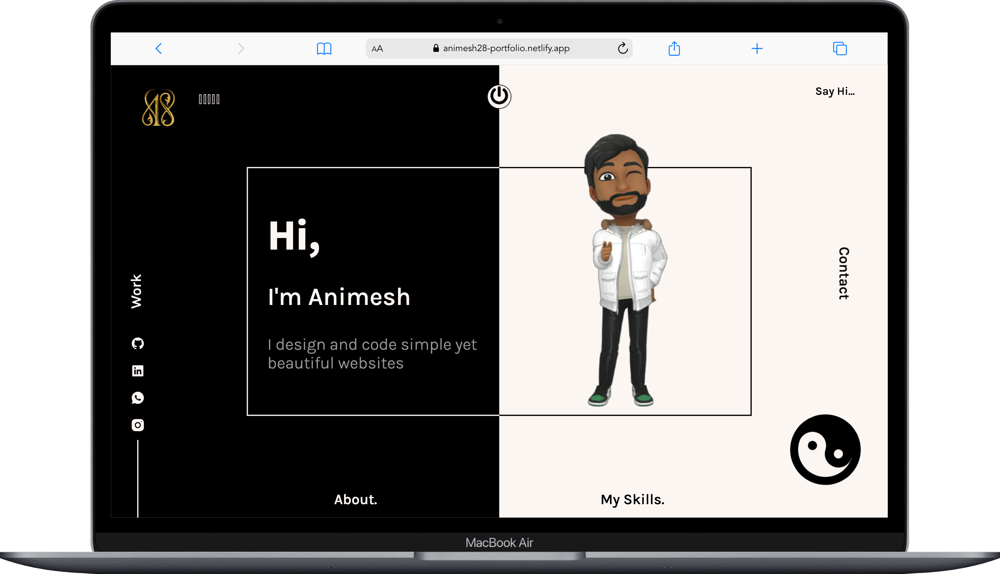

<p align="center">
  
</p>

# Hey there! I'm Animesh 👋

<main style="padding: 0 5vw;">
<table>
<tr>
    <td >
      <h3 align="left">About me:</h3>
      <h4>My tenet: Be happy with what you have, while wondering what you want</h4>
      <p align="left">
        <a href="https://animesh28-portfolio.netlify.app" style="margin: 0 5px" target="_blank">
          
        </a>
        <a href="https://instagram.com/words.healer" style="margin: 0 5px" target="_blank" >
          
        </a>
      </p>
    </td>
  </tr>
</table>
  <table>
  <tr >
  <td >
    <h3 align="left">Connect with me:</h3>
    <p align="left">
      <a
        href="https://linkedin.com/in/animesh-singh-02a9b417b"
        target="_blank"
        style="margin: 0 5px"
        >
      </a>
      <a
        href="https://instagram.com/_ani_mesh._"
        target="_blank"
        style="margin: 0 5px"
        ></a>
      <a
        href="https://www.leetcode.com/user3781jp"
        target="_blank"
        style="margin: 0 5px"
        ></a>
      <a
        href="https://auth.geeksforgeeks.org/user/animeshrajom"
        target="_blank"
        style="margin: 0 5px"
        ></a>
    </p>
    <h3 align="left">Languages and Tools:</h3>
    <p align="left">
        
        
        
        
        
        
        
        
        
        
        
        
        
        
    </p>
  </td>
  <td>
    
  </td>
      <tr/>
    </table>
</main>

```javascript
console.log("Welcome to my world 🌎");
```

## Education

|         **Institute**          | **Course** | **Score** |
| :----------------------------: | :--------: | :-------: |
| Siksha O Anusandhan University |  B.Tech.   |   9.55    |
| Surendranath Centenary School  |    12th    |   96.4%   |
| Surendranath Centenary School  |    10th    |    93%    |

## Work Life

- Maersk Global
  - Type: Internship
  - Position: DevOps Engineer
  - Duration: Jul 2023 - Till Date
- Webalar
  - Type: Freelancing
  - Position: Full Stack Developer
  - Duration: Oct 2022 - Till Date
- Geeks for Geeks
  - Type: Internship
  - Position: Technical Content Writer
  - Duration: Sep 2022 - Nov 2022
- Global Info Cloud
  - Type: Internship
  - Position: Front End Developer
  - Duration: Sep 2021 - Nov 2021
- Dainik Bharat 24
  - Type: Freelancing
  - Position: Wordpress Developer
  - Duration: Oct 2020 - Nov 2020

## Sample Work

<details>
  <summary>Apple Clone</summary>
  <table>
    <tr>
      <td>
        
      </td>
      <td>
        
      </td>
    </tr>
    <p align="center">    
      <a href="https://iphone3d-clone.netlify.app/" target="_blank">Visit Now</a>
    </p>
  </table>
</details>

<details>
  <summary>Paperhood</summary>
  <table>
    <tr>
      <td>
        
      </td>
      <td>
        
      </td>
    </tr>
    <p align="center">    
      <a href="http://paperhood.netlify.app/" target="_blank">Visit Now</a>
    </p>
  </table>
</details>

<details>
  <summary>Windor</summary>
  <table>
    <tr>
      <td>
        
      </td>
      <td>
        
      </td>
    </tr>
    <p align="center" >    
      <a href="https://windor.webalar.tech/" target="_blank" >Visit Now</a>
    </p>
  </table>
</details>

<details>
  <summary>Disney+ Clone</summary>
  <table>
    <tr>
      <td>
        
      </td>
      <td>
        
      </td>
    </tr>
    <p align="center" >    
      <a href="https://disneyplus-clone-fe126.web.app/" target="_blank" >Visit Now</a>
    </p>
  </table>
</details>

<details>
  <summary>Natours</summary>
  <table>
    <tr>
      <td>
        
      </td>
      <td>
        
      </td>
    </tr>
    <p align="center">    
      <a href="https://animesh28.github.io/Natours/" target="_blank" >Visit Now</a>
    </p>
  </table>
</details>

<details>
  <summary>Portfolio - Explore More</summary>
  <table>
    <tr>
      <td>
        
      </td>
      <td>
        
      </td>
    </tr>
    <p align="center">    
      <a href="https://animesh28-portfolio.netlify.app/" target="_blank" >Visit Now</a>
    </p>
  </table>
</details>
